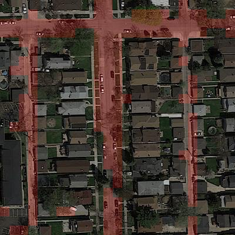

# Road Segmentation  

Collaborators:
* [JBouron](https://github.com/jbouron)
* [Rimbaud13](https://github.com/rimbaud13)    
* [Trofleb](https://github.com/trofleb)

### Table of Contents :
  * [Introduction](#introduction)
  * [Results](#results)
  * [Setup](#setup)
    * [Python](#pyton)
    * [Environment](#environment)
  * [Code overview](#code-overview)
  * [Configuration](#configuration)
  * [Running](#running)


### Introduction
  This project is part of the [EPFL](www.epfl.ch) "Pattern classification and machine
learning" class. More specifically, it is our solution for the second project
on road segmentation.
  This file gives an overview of our code and how it functions. All
additional explanations about the project itself can be found in the official
paper for it (the `paper.pdf` file).

  The goal of the project is to segment a satellite image of earth by determing
  which patches of 16x16 pixels are roads or not.

  In short, the code runs a first convolutional neural network to get basic predictions. After this it runs a second one, a postprocessing one, which uses the previously computed predictions to give a final prediction.

### Results
We achieved about a 0.91 F1-score, below you will find an image illustrating
the qualitative result achieved. Every detected road patch is covered in red on
the image.
  



### Setup
  The machine learning part of the code runs entirely on python. These
are our recommendations for the package versions and environment.

#### Python
  These are the python and its packages versions used to produce our
results. Python should be available at https://www.python.org/ and it's packages
can be found with 'pip' https://docs.python.org/3.5/installing/.
```
python: version 3.5
matplotlib : version 1.5.3
numpy : version 1.11.2
scipy : version 0.18.1
Pillow : version 3.3.1
tensorflow : version 0.12.0
progressbar2 : version 3.11.0
```

#### Environment
  These are general recommendations for the environment in which the code
runs:
  1. If possible use a CUDA enabled GPU. Tensorflow supports CUDA enabled
GPUs, which accelerates widely the computation needed by this project. More
documentation can be found
[here](https://www.tensorflow.org/get_started/os_setup).
  2. Use a minimalist linux distribution and avoid performing other tasks
while the code is running. A typical run of our code is computationally
intensive, keeping the amount of resources available to our code as high as
possible will reduce its running time. We highly recommend
[Arch Linux](https://www.archlinux.org/).
  3. [Here](https://inclass.kaggle.com/c/epfml-segmentation) are the datasets.
The training set should be at the root of the project in a folder named
`training/` and the test set should be flattened into a folder named
`test_set_images/`.
  4. Do not delete the empty folders in the project, they are needed for outputs. Depending on the environment, our code is not allowed to create the folder by itself, hence our warning about the empty folders.


### Code overview
The `run.py` file is the main file which runs our code from with the parameters found `global_vars.py` and `global_vars_pp.py`. The `learner.py` file contains the main Tensorflow code - it setups the model and runs the validation. `logger.py`, `prediction_helpers`, `image_helpers`, `mask_to_submission.py` and `tf_helpers.py` are files which contain helper methods to modularize our code.

### Configuration
  In the `global_vars.py` file are all the parameters which will be used for the
first neural network. The `global_vars_pp.py` file contains the parameters for
the postprocessing neural network. Documentation about each parameter can be
found in the individual files.

The default parameters will load a pretrained model which was built from the other default parameters we provide.

### Running
16 GB of RAM + swap space is needed at least in order to run our optimal result (even when loading the model from the files).

  Running the code is straight forward - simply use:
```
python3.5 run.py
```
in your favorite terminal emulator at the root of the project folder. If you did not change `global_vars.py` and `global_vars_pp.py` files, it will load our best model and compute the predictions with them (this should take about 10 mins). However if you decide to relearn the model by yourself, the runtime can take over two hours for our optimal parameters.
  The run produces the following folders and files :

* `test_predictions` : Contains the predictions on the images in the `test_set_images` folder after the first neural network.

* `test_predictions_pp` : Contains the predictions on the images in the `test_set_images` folder after the postprocessing neural network.

The predictions for kaggle can then be created by running
```
python3.5 mask_to_submission.py
or
python3.5 mask_to_submission.py test_predictions_pp/
```
The first command will create a `dummy_submisison.csv` file which is computed from the results in `test_predictions` (without postprocessing). Whereas, the second created the same file but this time from the `test_predictions_pp` results (with postprocessing).
